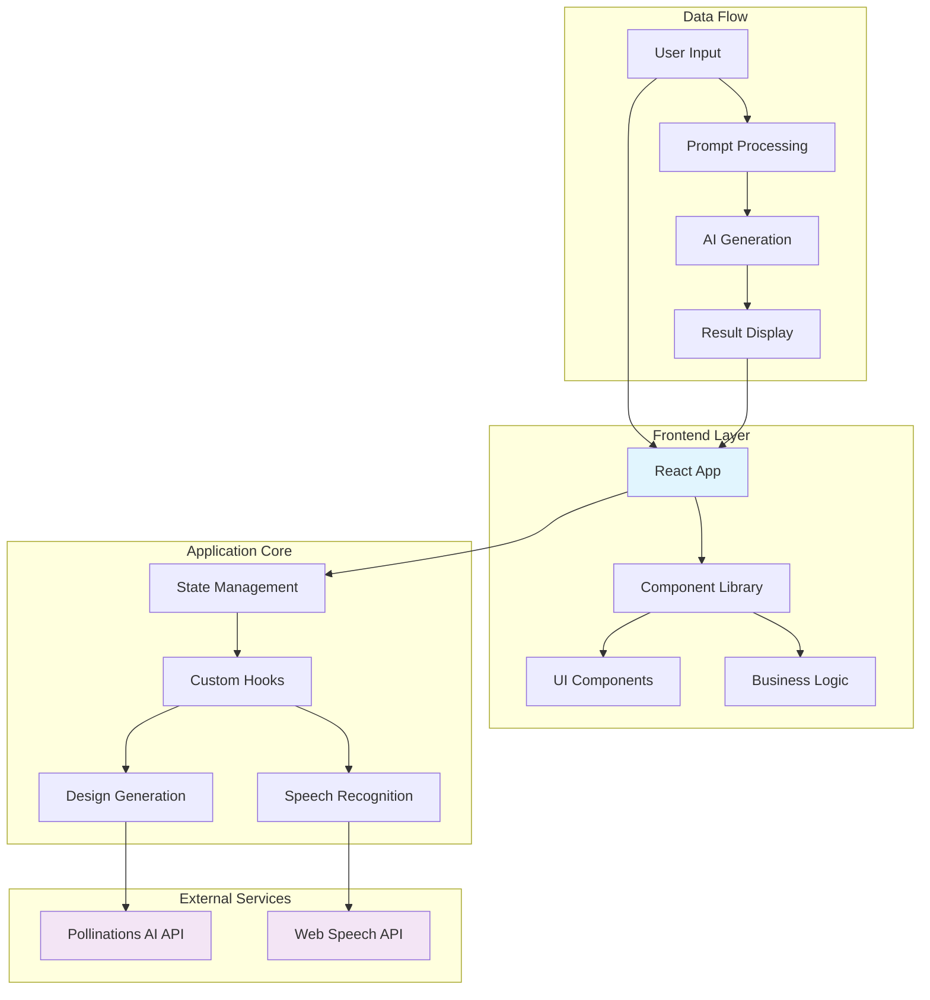
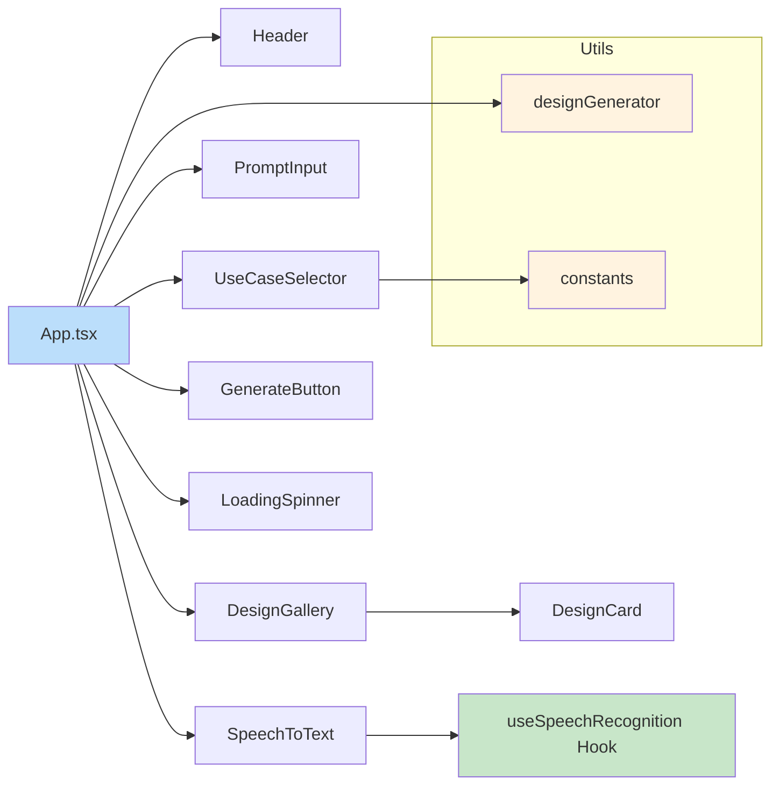
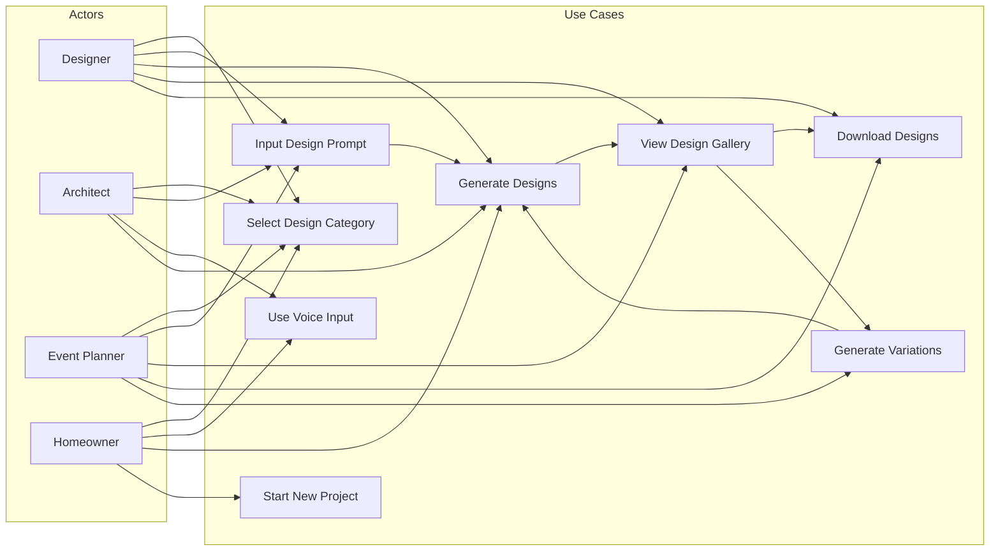
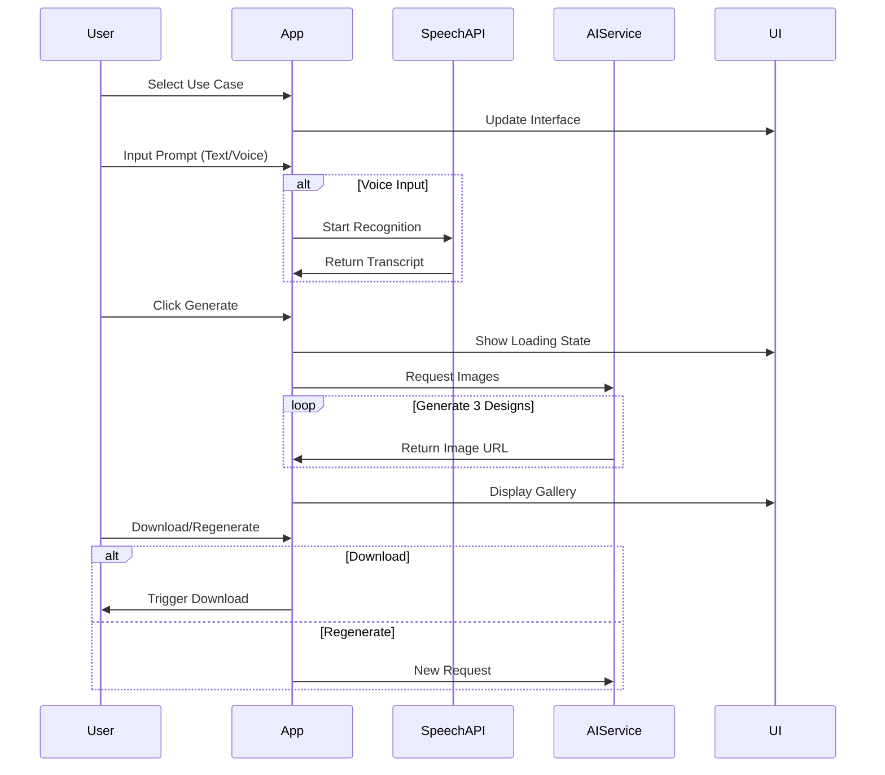

# AI Design Studio

A modern, AI-powered design generation platform that transforms user ideas into stunning visual concepts across multiple design categories. Built with React, TypeScript, and modern web technologies.

## 🎨 Overview

AI Design Studio is an intuitive web application that empowers users to generate professional design concepts through AI. Whether you're working on interior design, architecture, construction planning, or event design, our platform provides instant visual inspiration tailored to your specific needs.

### ✨ Key Features

- **Multi-Category Design Generation**: Supports Interior Design, Architecture, Construction, and Event Design
- **AI-Powered Visual Creation**: Generates unique design concepts based on user prompts
- **Voice Input Support**: Speech-to-text functionality for hands-free interaction
- **Interactive Gallery**: Smooth carousel with download capabilities
- **Responsive Design**: Optimized for desktop, tablet, and mobile devices
- **Real-time Generation**: Fast design creation with elegant loading states
- **Professional UI/UX**: Modern glassmorphism design with smooth animations

## 🛠 Technology Stack

### Frontend Framework
- **React 18** with TypeScript
- **Tailwind CSS** for styling
- **Custom CSS Animations** for enhanced UX

### Core Libraries
- **React Hooks** (useState, useEffect, custom hooks)
- **Web Speech API** for voice recognition
- **Pollinations AI** for image generation

### Development Tools
- **Create React App** for bootstrapping
- **Jest & Testing Library** for testing
- **ESLint & TypeScript** for code quality

## 🏗 System Architecture



### Component Architecture



## 📋 Use Case Diagram



## 🔄 System Flow Diagram



## 📁 Project Structure

```
src/
├── components/           # Reusable UI components
│   ├── DesignCard.tsx   # Individual design display
│   ├── DesignGallery.tsx # Design results container
│   ├── GenerateButton.tsx # Action button component
│   ├── Header.tsx       # Page header
│   ├── LoadingSpinner.tsx # Loading state
│   ├── PromptInput.tsx  # Text input component
│   ├── SpeechToText.tsx # Voice input component
│   └── UseCaseSelector.tsx # Category selection
├── hooks/               # Custom React hooks
│   └── useSpeechRecognition.ts # Speech API integration
├── types/               # TypeScript type definitions
│   └── index.ts        # Application interfaces
├── utils/               # Utility functions
│   ├── constants.ts    # Application constants
│   └── designGenerator.ts # AI generation logic
├── App.tsx             # Main application component
├── App.css             # Component-specific styles
├── index.tsx           # Application entry point
└── index.css           # Global styles
```

## 🚀 Getting Started

### Prerequisites

- Node.js (v16 or higher)
- npm or yarn package manager

### Installation

1. **Clone the repository**
   ```bash
   git clone https://github.com/your-username/ai-design-studio.git
   cd ai-design-studio
   ```

2. **Install dependencies**
   ```bash
   npm install
   # or
   yarn install
   ```

3. **Start development server**
   ```bash
   npm start
   # or
   yarn start
   ```

4. **Open your browser**
   Navigate to `http://localhost:3000`

### Build for Production

```bash
npm run build
# or
yarn build
```

This creates an optimized production build in the `build/` folder.

## 🎯 Usage Guide

### Basic Workflow

1. **Select Design Category**
   - Choose from Interior Design, Architecture, Construction, or Event Design

2. **Describe Your Vision**
   - Type your design requirements in the text input
   - Or use the voice input feature by clicking the microphone button

3. **Generate Designs**
   - Click "Generate Design Concepts" to create AI-powered visuals
   - Wait for the generation process to complete

4. **Explore Results**
   - Browse through the generated designs in the interactive gallery
   - Each design includes unique highlights and features

5. **Download & Iterate**
   - Download your favorite designs
   - Generate variations or start a new project

### Voice Input

The application supports voice input through the Web Speech API:

- Click the microphone button to start listening
- Speak clearly in English
- The system will automatically convert speech to text
- Works best in quiet environments

## 🔧 Configuration

### Design Categories

Modify available categories in `src/utils/constants.ts`:

```typescript
export const USE_CASES = [
  'Interior Design',
  'Architecture', 
  'Construction',
  'Event Design'
] as const;
```

### Styling Customization

The application uses Tailwind CSS with custom animations. Modify styles in:

- `src/index.css` - Global styles
- `src/App.css` - Component-specific styles
- Inline Tailwind classes for component styling

## 🧪 Testing

Run the test suite:

```bash
npm test
# or
yarn test
```

For coverage report:

```bash
npm test -- --coverage
# or
yarn test --coverage
```

## 📊 Performance Considerations

### Optimization Features

- **Lazy Loading**: Images load on demand
- **Smooth Animations**: CSS transitions with GPU acceleration
- **Responsive Design**: Optimized for all screen sizes
- **Efficient Re-renders**: Proper React key usage and state management

### Browser Compatibility

- Modern browsers (Chrome, Firefox, Safari, Edge)
- Speech recognition requires HTTPS in production
- Graceful degradation for unsupported features

## 🔐 Security & Privacy

- No user data storage or tracking
- Client-side processing only
- External AI service integration via public APIs
- Speech processing handled locally by browser

## 🌟 Future Enhancements

### Planned Features

- [ ] User authentication and project saving
- [ ] Advanced AI model integration
- [ ] Collaborative design sharing
- [ ] Export to professional formats (CAD, PDF)
- [ ] Integration with design software
- [ ] Multi-language support
- [ ] Advanced filtering and search
- [ ] Design history and versioning

### Technical Improvements

- [ ] Progressive Web App (PWA) capabilities
- [ ] Offline functionality
- [ ] Advanced caching strategies
- [ ] Performance monitoring
- [ ] A/B testing framework

## 🤝 Contributing

We welcome contributions! Please follow these steps:

1. Fork the repository
2. Create a feature branch (`git checkout -b feature/amazing-feature`)
3. Commit your changes (`git commit -m 'Add amazing feature'`)
4. Push to the branch (`git push origin feature/amazing-feature`)
5. Open a Pull Request

### Development Guidelines

- Follow TypeScript best practices
- Maintain component modularity
- Write comprehensive tests
- Follow the existing code style
- Update documentation for new features

## 📄 License

This project is licensed under the MIT License - see the [LICENSE](LICENSE) file for details.

## 👥 Team

- **Frontend Development**: React/TypeScript specialists
- **UI/UX Design**: Modern design system implementation
- **AI Integration**: Machine learning and API integration
- **Quality Assurance**: Testing and performance optimization

## 📞 Support

For support and questions:

- 📧 Email: support@aidesignstudio.com
- 💬 Discord: [Join our community](https://discord.gg/aidesignstudio)
- 📖 Documentation: [Full API docs](https://docs.aidesignstudio.com)
- 🐛 Issues: [GitHub Issues](https://github.com/your-username/ai-design-studio/issues)

## 🙏 Acknowledgments

- [Pollinations AI](https://pollinations.ai/) for image generation services
- [Tailwind CSS](https://tailwindcss.com/) for the utility-first CSS framework
- [React](https://reactjs.org/) for the component-based architecture
- All contributors and beta testers

---

**Made with ❤️ by the AI Design Studio Team**

*Transforming ideas into visual reality through the power of artificial intelligence.*
